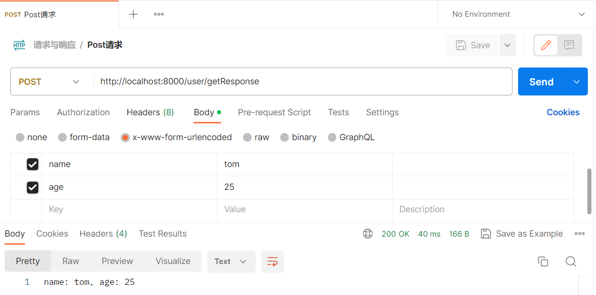
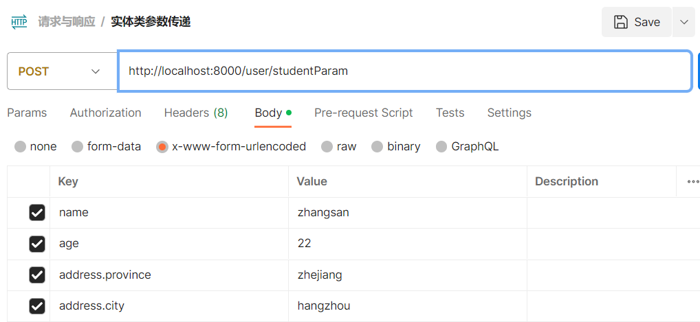
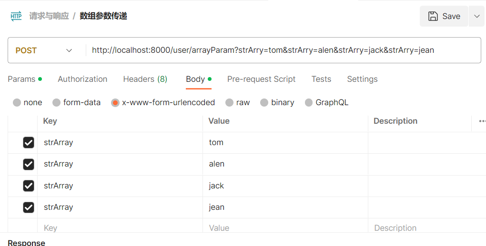
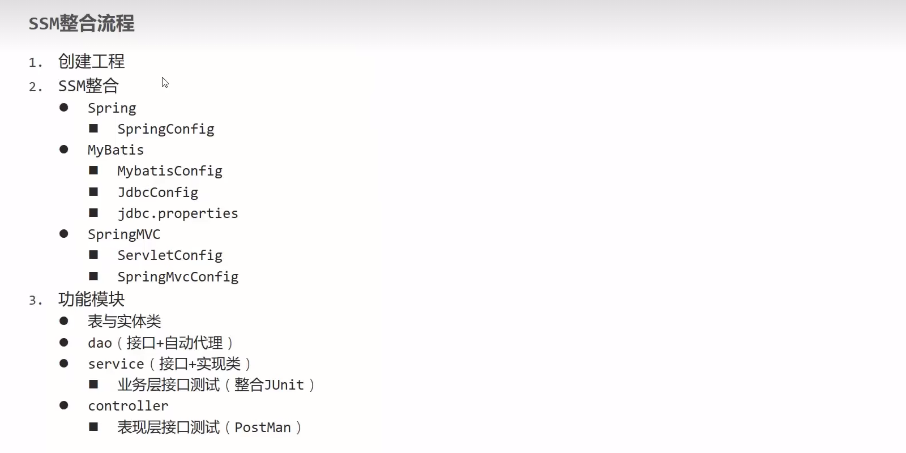
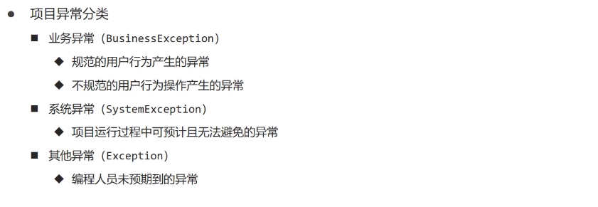
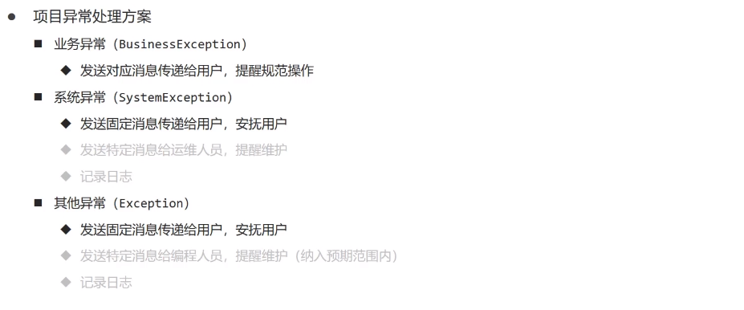
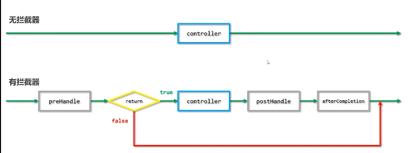
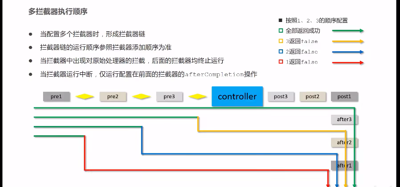

<!-- TOC -->
* [一. SpringMVC简介](#一-springmvc简介)
  * [1. SpringMVC概述](#1-springmvc概述-)
  * [2. 入门案例](#2-入门案例)
  * [3. 入门案例工作流程](#3-入门案例工作流程)
  * [4. Controller加载控制与业务bean加载控制](#4-controller加载控制与业务bean加载控制)
  * [5. PostMan软件](#5-postman软件)
* [二. 请求与响应](#二-请求与响应)
  * [1. 请求映射路径](#1-请求映射路径)
  * [2. 请求参数](#2-请求参数)
    * [(1). 接收Get请求参数](#1-接收get请求参数)
    * [(2). Post请求](#2-post请求)
    * [(3). Post中文参数的传递问题](#3-post中文参数的传递问题)
    * [(4). 参数不同名的问题](#4-参数不同名的问题)
    * [(5). 各种参数的传递](#5-各种参数的传递)
    * [(6). JSON数据的传递(重点)](#6-json数据的传递重点)
  * [3. 日期类型参数传递](#3-日期类型参数传递)
  * [4.](#4-)
    * [(1). 响应页面/跳转页面](#1-响应页面跳转页面)
    * [(2). 响应纯文本数据](#2-响应纯文本数据)
    * [(3). 响应POJO对象(JSON数据对象)](#3-响应pojo对象json数据对象)
    * [(4). 响应POJO数组(JSON对象数组)](#4-响应pojo数组json对象数组)
* [三. REST风格](#三-rest风格)
  * [1. REST简介](#1-rest简介)
  * [2. RESTful入门案例](#2-restful入门案例)
  * [3. REST快速开发](#3-rest快速开发)
  * [4. 案例: 基于RESTful页面数据交互](#4-案例-基于restful页面数据交互)
    * [(1). 后台接口准备](#1-后台接口准备)
    * [(2). 页面访问处理](#2-页面访问处理)
* [四. SSM整合](#四-ssm整合)
  * [1. 接口测试异常处理](#1-接口测试异常处理)
  * [2.表现层数据封装](#2表现层数据封装)
  * [3. 异常处理器](#3-异常处理器)
  * [4. 项目异常处理方案](#4-项目异常处理方案)
  * [5. SSM整合前后台协议联调](#5-ssm整合前后台协议联调)
* [五. 拦截器](#五-拦截器)
  * [1. 拦截器简介](#1-拦截器简介)
  * [2. 制作拦截器功能类](#2-制作拦截器功能类)
  * [3. 拦截器参数](#3-拦截器参数)
  * [4. 多拦截器链配置](#4-多拦截器链配置)
<!-- TOC -->

# 一. SpringMVC简介
## 1. SpringMVC概述 
- SpringMVC技术与Servlet技术功能等同, 均属于web层开发技术
- 是一种基于Java实现MVC模型的轻量级Web框架
- 优点:
   - 使用简单, 开发便捷(相比于Servlet)
   - 灵活性强

## 2. 入门案例
(1). 使用SpringMVC技术需要先导入SpringMVC与Servlet坐标
```xml
<dependency>
      <groupId>javax.servlet</groupId>
      <artifactId>javax.servlet-api</artifactId>
      <version>3.1.0</version>
      <scope>provided</scope>
    </dependency>
    <dependency>
      <groupId>org.springframework</groupId>
      <artifactId>spring-webmvc</artifactId>
      <version>5.2.20.RELEASE</version>
    </dependency>
```
(2). 创建SpringMVC控制器类(等同于Servlet功能)
```java
/*
 * 2. 定义controller
 * 使用@Controller定义bean
 * */
@Controller
public class UserController {

    /*
    * 设置当前操作的访问路径
    * @RequestMapping("/save")
    * 设置当前操作的返回值类型
    * @ResponseBody
    * */
    @RequestMapping("/save")
    @ResponseBody
    public String save() {
        System.out.println("user save...");
        return "{'module':'springmvc'}";
    }
}
```
(3). 初始化SpringMVC环境(同Spring环境), 设定SpringMVC加载对应的bean
```java
/*
* 创建springmvc的配置文件, 加载controller对应的bean
* */
@Configuration
@ComponentScan("com.itstudy.controller")
public class SpringMvcConfig {
}
```
(4). 初始化Servlet容器, 加载SpringMVC环境, 并设置SpringMVC技术处理的请求
```java
/*
* 定义一个servlet容器启动的配置类, 在里面加载spring的配置
* 需要继承一个抽象类AbstractDispatcherServletInitializer
* */
public class ServletContainersInitConfig extends AbstractDispatcherServletInitializer {
    /*
    * 加载springMVC容器配置
    * */
    @Override
    protected WebApplicationContext createServletApplicationContext() {
        AnnotationConfigWebApplicationContext ctx = new AnnotationConfigWebApplicationContext();
        //注册你的springMVC配置
        ctx.register(SpringMvcConfig.class);
        return ctx;
    }

    /*
    * 设置哪些请求归属springMVC处理
    * "/"所有请求归springMVC处理
    * */
    @Override
    protected String[] getServletMappings() {
        return new String[]{"/"};
    }

    /*
    * 加载Spring容器配置
    * 目前没有可以返回null
    * */
    @Override
    protected WebApplicationContext createRootApplicationContext() {
        return null;
    }
}
//简单的一种写法, 继承这个类AbstractAnnotationConfigDispatcherServletInitializer
public class ServletContainersInitConfig extends AbstractAnnotationConfigDispatcherServletInitializer {

  /*
   * 加载Spring容器配置
   * */
  @Override
  protected Class<?>[] getRootConfigClasses() {
    return new Class[]{SpringConfig.class};
  }

  /*
   * 加载springMVC容器配置
   * */
  @Override
  protected Class<?>[] getServletConfigClasses() {
    return new Class[]{SpringMvcConfig.class};
  }

  /*
   * 设置哪些请求归属springMVC处理
   * "/"所有请求归springMVC处理
   * */
  @Override
  protected String[] getServletMappings() {
    return new String[]{"/"};
  } 
}
```
(5). 配置tomcat插件
```xml

<build>
    <plugins>
        <plugin>
            <groupId>org.apache.tomcat.maven</groupId>
            <artifactId>tomcat7-maven-plugin</artifactId>
            <version>2.1</version>
            <configuration>
                <path>/</path>
            </configuration>
        </plugin>
    </plugins>
</build>
```
## 3. 入门案例工作流程
- 启动服务器初始化过程
   - 服务器启动, 执行ServletContainersInitConfig类, 初始化web容器
   - 执行createServletApplicationContext方法, 创建了WebApplicationContext对象
   - 加载SpringMvcConfig
   - 执行@ComponentScan加载对应的bean
   - 加载UserController, 每个@ReqyestMapping的名称对应一个具体的方法
   - 执行getServletMappings方法, 定义所有的请求都通过SpringMVC
- 单次请求过程
   - 发送请求localhost/save
   - web容器发现所有请求都经过SpringMVC, 将请求交给SpringMVC处理
   - 解析请求路径/save
   - 由/save匹配执行对应的方法save()
   - 执行save()
   - 检测到有@ResponseBody直接将save()方法的返回值作为响应请求体返回给请求方

## 4. Controller加载控制与业务bean加载控制
- SpringMVC相关bean(表现出bean)
- Spring控制的bean
   - 业务bean(Service)
   - 功能bean(DataSource等)

(1). 因为功能不同, 如何避免Spring错误的加载到springMVC的bean?

加载Spring控制的bean的时候排除掉SpringMVC控制的bean
- SpringMVC相关bean加载控制
   - SpringMVC加载的bean对应的包均在com.itstudy.controller包内
- Spring相关bean加载控制
   - 方式一: Spring加载的bean设定扫描范围为聪明.itstudy, 排除掉controller包内的bean
```java
@Configuration
/*
 * 按照注解的方式排除掉@Controller注解的bean
 * */
@ComponentScan(value = "com.itstudy",
        excludeFilters = @ComponentScan.Filter(type = FilterType.ANNOTATION, classes = Controller.class))
public class SpringConfig {
}
```
   - 方式二: Spring加载的bean设定扫描范围为精确范围, 精确到service包, dao包
```java
@Configuration
@ComponentScan({"com.itstudy.service", "com.itstudy.dao"})
public class SpringConfig {
}
```
   - 方式三: 将Spring和SpringMVC加载到同一个环境中

## 5. PostMan软件
安装PostMan软件用于页面请求与访问

# 二. 请求与响应
## 1. 请求映射路径
团队多人开发, 没人设置不同的请求路径, 冲突问题如何解决?

设置模块名作为请求路径前缀, 直接在类名上注解上路径前缀, 也可以在一个一个方法上注解上前缀路径
```java
@RestController
@RequestMapping("/user")
public class UserController {
}
```
## 2. 请求参数
### (1). 接收Get请求参数
表现层直接设置传递的形参name
```java
@RestController
@RequestMapping("/user")
public class UserController {
    /*
     * Get/Post请求传递参数
     * */
    @RequestMapping("/getResponse")
    @ResponseBody
    public String getResponse(String name) {
        System.out.println("普通参数传递 name ==> " + name);
        return "参数name: " + name + " 传递成功";
    }
}
```
Postman软件直接get发送url为`user/getResponse?name=zhansan`, 后缀用?来传递参数
```
普通参数传递 name ==> zhansan
```
传递多个参数用&符号来连接在一起`user/getResponse?name=zhansan&age=23`
```
普通参数传递 name ==> zhansan
普通参数传递 age ==> 23
```
### (2). Post请求
对于Get和Post请求, 后台代码都是没有变化的, 变化的是参数游览器传过来的方式

Post请求用表单的格式来传递



### (3). Post中文参数的传递问题
中文传递的过程中会发生乱码, 需要为SpringMVC设置过滤器, 为过滤器设置字符集
```java
public class ServletContainersInitConfig extends AbstractAnnotationConfigDispatcherServletInitializer {
    /*
    * 中文乱码处理
    * */
    @Override
    protected Filter[] getServletFilters() {
        CharacterEncodingFilter filter = new CharacterEncodingFilter();
        //设置字符集
        filter.setEncoding("UTF-8");
        return new Filter[]{filter};
    }
}
```
设置后进行中文参数传递测试
```
普通参数传递 name ==> 张三
普通参数传递 age ==> 25
```
中文参数成功传递进来

### (4). 参数不同名的问题
```
@RequestMapping("/getResponse")
    @ResponseBody
    public String getResponse(@Param("name") String username, int age) {
        System.out.println("普通参数传递 name ==> " + username);
        System.out.println("普通参数传递 age ==> " + age);
        return "name: " + username + ", age: " + age;
    }
```
此时参数传递进来是null
```
普通参数传递 name ==> null
```
解决方法, 在参数前注解上传进来的别名`@RequestParam`
```java
@RestController
@RequestMapping("/user")
public class UserController {
    @RequestMapping("/getResponse")
    @ResponseBody
    public String getResponse(@RequestParam("name") String username, int age) {
        System.out.println("普通参数传递 name ==> " + username);
        System.out.println("普通参数传递 age ==> " + age);
        return "name: " + username + ", age: " + age;
    }
}
```
结果参数传递进来
```
普通参数传递 name ==> 张三
普通参数传递 age ==> 25
```

### (5). 各种参数的传递
- 实体类参数传递
```java
@RestController
@RequestMapping("/user")
public class UserController {
    /*
     * 实体类参数传递
     * */
    @RequestMapping("studentParam")
    @ResponseBody
    public String studentParam(Student student) {
      System.out.println("参数传递user: " + student);
      return student.toString();
    }
}
```
怎么进行参数传递呢? Get/Post请求的话直接传递多个参数, SpringMVC能够依据传递进来的属性名自动塞入实体类内同名的成员变量
```
参数传递student: Student{name = zhangsan, age = 22}
```

- 嵌套应用参数的传递, 实体类里还有一个实体类型的成员变量
同样是按同名属性一起给塞进去, 嵌套的那个实体类属性需要使用点语法来传递参数
```java
public class Student {
    private String name;
    private int age;
    
    private Address address;
}
```
Get/Post传递的方式



参数传递结果
```
参数传递student: Student{name = zhangsan, age = 22, address = Address{province = zhejiang, city = hangzhou}}
```
- 数组参数传递
```java
@RestController
@RequestMapping("/user")
public class UserController {
    /*
     * 数组参数传递
     * */
    @RequestMapping("arrayParam")
    @ResponseBody
    public String arrayParam(String[] strArray) {
        System.out.println("数组参数传递 ==> " + Arrays.toString(strArray));
        return Arrays.toString(strArray);
    }
}

```
Get/Post传递的方式, 直接写多个同名key的不同value



```
数组参数传递 ==> [tom, alen, jack, jean]
```
- 集合参数的传递
```java
@RestController
@RequestMapping("/user")
public class UserController {
/*
    * 集合参数传递
    * */
    @RequestMapping("listParam")
    @ResponseBody
    public String listParam(@RequestParam List<String> strList) {
        System.out.println("数组参数传递 ==> " + strList);
        return strList.toString();
    }
}
```
与数组的传递有一个地方不同, 对于集合需要在参数前加上@RequestParam注解

传递方式与数组一样, 传递结果: 
```
[tom, alen, jack]
```
### (6). JSON数据的传递(重点)
导入JSON的坐标依赖
```xml

<dependency>
    <groupId>com.fasterxml.jackson.core</groupId>
    <artifactId>jackson-databind</artifactId>
    <version>2.9.0</version>
</dependency>
```
编写方法, 注意json数据实在body里的, 所以参数注解需要改为@RequestBody
```java
@RestController
@RequestMapping("/user")
public class UserController {
    /*
     * json数据传递, 集合参数
     * */
    @RequestMapping("listParamForJson")
    @ResponseBody
    public String listParamForJson(@RequestBody List<String> strList) {
        System.out.println("json数据传递 ==> " + strList);
        return strList.toString();
    }
}
```
SpringMVC开启json数据自动解析注解@EnableWebMvc
```java
@Configuration
@ComponentScan("com.itstudy.controller")
@EnableWebMvc
public class SpringMvcConfig {
}
```
- 传递json数组数据
先用Postman传递json数组数据`["tom","alen","jack"]`, 传递结果:
```
json数据传递 ==> [tom, alen, jack]
```
如果是对象数组的json数据一样可以接收, 把参数改成List<Student>就行
- 传递json对象数据
```json
{
    "name":"tom",
    "age":"23",
    "address":{
        "province":"jiangshu",
        "city":"nanjing"
    }
}
```
一样接收的参数需要注解上`@RequestBody`
```java
@RestController
@RequestMapping("/user")
public class UserController {
    /*
     * json数据传递, 对象pojo参数
     * */
    @RequestMapping("studentParamForJson")
    @ResponseBody
    public String studentParamForJson(@RequestBody Student student) {
        System.out.println("参数传递student: " + student);
        return student.toString();
    }
}
```
传递结果:
```
参数传递student: Student{name = tom, age = 23, address = Address{province = jiangshu, city = nanjing}}
```
- @RequestParam 与 @RequestBody 区别
- 区别
   - @RequestParam用于接收url地址传参, 表单传参[application/x-www-form-urlencoded]
   - @RequestBody用于接收json数据[application/json]
- 应用
   - 后期开发中, 发送json格式数据为主, @RequestBody应用较广
   - 如果发送非json格式数据, 选用@RequestParam接收请求参数
## 3. 日期类型参数传递
- 不同的日期格式
   - 2088-08-18
   - 2088/08/18
   - 08/18/2088

- 对于2088/08/18的格式, SpringMVC能够自动解析
```java
@Controller
@RequestMapping("date")
public class DateController {

    @RequestMapping("dateResponse")
    @ResponseBody
    public String dateResponse01(Date date) {
        System.out.println("日期格式传递 ==> " + date);
        return date.toString();
    }
}

```
解析结果: 
```
日期格式传递 ==> Thu Jun 09 00:00:00 CST 2022
```
- 对于2088-08-18的格式, 需要指定参数的时间匹配规则
```java
@Controller
@RequestMapping("date")
public class DateController {
    @RequestMapping("dateResponse")
    @ResponseBody
    public String dateResponse02(@DateTimeFormat(pattern = "yyyy-MM-dd") Date date) {
        System.out.println("日期格式传递 ==> " + date);
        return date.toString();
    }
}
```
传递结果: 
```
日期格式传递 ==> Thu Jun 02 00:00:00 CST 2022
```
- 对于08/18/2088的格式, 将匹配规则改成`"dd-MM-yyyy"`, 要加上时间时匹配规则也可以改成`yyyy-MM-dd HH:mm:ss`
- 实现原理: 类型转换器
Converter接口
```java
public interface Converter<S, T> {
    @Nullable
    T convert(S var1);
}
```
请求参数年龄数据(String -> Integer)

日期格式转换(String -> Date)

## 4. 
下面只放出各种数据响应的写法
### (1). 响应页面/跳转页面
```java
@Controller
@RequestMapping("/response")
public class ResponseController {

    /*
    * 响应页面/跳转页面
    * */
    @RequestMapping("/toJumpPage")
    public String toJumpPage() {
        System.out.println("跳转页面");
        return "page.jsp";
    }
    
}
```
### (2). 响应纯文本数据
```java
@Controller
@RequestMapping("/response")
public class ResponseController {

    /*
    * 响应文本数据
    * */
    @RequestMapping("/toText")
    @ResponseBody
    public String toText() {
        System.out.println("返回纯文本数据");
        return "response txt";
    }
    
}
```
### (3). 响应POJO对象(JSON数据对象)
```java

@Controller
@RequestMapping("/response")
public class ResponseController {
    
    /*
    * 响应POJO对象
    * */
    @RequestMapping("/toJsonPOJO")
    @ResponseBody
    public Student toJsonPOJO() {
        System.out.println("返回json对象数据");
        Student student = new Student();
        student.setName("tom");
        student.setAge(21);
        return student;
    }
    
}
```
### (4). 响应POJO数组(JSON对象数组)
```java
@Controller
@RequestMapping("/response")
public class ResponseController {
    @RequestMapping("/toJsonList")
@ResponseBody
public List<Student> toJsonList() {
        System.out.println("返回json对象数组");
        Student student1 = new Student();
        student1.setName("tom");
        student1.setAge(21);

        Student student2 = new Student();
        student2.setName("jack");
        student2.setAge(22);

        List<Student> studentList = new ArrayList<>();
        studentList.add(student1);
        studentList.add(student2);

        return studentList;
        }
        }
```
上面响应的实现是通过jackson工具实现的, 类型转换是通过HttpMessageConverter接口实现的
```java
public interface HttpMessageConverter<T> {
    boolean canRead(Class<?> var1, @Nullable MediaType var2);

    boolean canWrite(Class<?> var1, @Nullable MediaType var2);

    List<MediaType> getSupportedMediaTypes();

    T read(Class<? extends T> var1, HttpInputMessage var2) throws IOException, HttpMessageNotReadableException;

    void write(T var1, @Nullable MediaType var2, HttpOutputMessage var3) throws IOException, HttpMessageNotWritableException;
}
```
# 三. REST风格
## 1. REST简介
REST(Representational State Transfer), 表现形式状态转换
- 传统风格资源描述形式:
    - http://localhost/users/getById?id=1
    - http://localhost/users/saveuser

- REST风格描述形式:
    - http://localhost/users/1
    - http://localhost/users

- 优点: 
    - 隐藏资源的访问行为, 无法通过地址得知对资源是何种操作
    - 书写简化
- 按照REST风格访问资源时使用行为动作区分对资源进行了何种操作
    - 查询全部用户信息 GET(查询)
    - 查询指定用户信息 GET(查询)
    - 添加用户信息    POST(新增/保存)
    - 修改用户信息    PUT(修改/更新)
    - 删除用户信息    DELETE(删除)
- 根据REST风格对资源进行访问称为RESTful

REST风格并不是规范, 是一种行为的约定方式, 描述模块的名称通常使用复数, 表示此类资源, 例如users

## 2. RESTful入门案例
在现有程序上限制访问行为即可, 同时形参还要加上网络路径变量注解`@PathVariable Student student`
```java
/*
 * 2. 定义controller
 * 使用@Controller定义bean
 * 统一访问域名设为users
 * 采用REST风格通过网页访问行为来区分方法
 * */
@RestController
@RequestMapping("/users")
public class UserController {
    @Autowired
    private UserService userService;

    /*
     * 设置当前操作的访问路径
     * @RequestMapping("/save")
     * 设置当前操作的返回值类型, 返回给游览器的游览方
     * @ResponseBody
     * method = RequestMethod.控制行为  GET,POST,PUT,DELETE
     * save方法采用RequestMethod.POST
     * */
    @RequestMapping(method = RequestMethod.POST)
    @ResponseBody
    public String save() {
        System.out.println("user save...");
        return "{'module':'springmvc-save'}";
    }

    /*
     * 删除方法RequestMethod.DELETE
     * */
    @RequestMapping(method = RequestMethod.DELETE)
    @ResponseBody
    public String delete() {
        System.out.println("user delete...");
        return "{'module':'springmvc-delete'}";
    }

    /*
     * 查询方法RequestMethod.GET
     * 设定请求参数(路径变量)
     * @PathVariable声明参数来自网络路径,
     * value = "/{id}告诉参数具体来自哪个网络路径的参数, 或者说网络参数往哪个形参传递
     * */
    @RequestMapping(value = "/{id}", method = RequestMethod.GET)
    @ResponseBody
    public String searchUser(@PathVariable Integer id) {
        System.out.println("user search...");
        return userService.select(id);
    }

    /*
     * 更新学生信息RequestMethod.PUT
     * @PathVariable声明参数来自网络路径,
     * value = "/{id}告诉形参来接收路径参数的的哪一个, 或者说路径参数该往哪里传
     * @RequestBody已经注明是JSON对象传递, 并不需要特地告诉参网络参数往哪个形参传递
     * */
    @RequestMapping(value = "/{id}", method = RequestMethod.PUT)
    @ResponseBody
    public String studentParam(@RequestBody Student student, @PathVariable Integer id) {
        System.out.println("参数传递, 修改id为" + id + "的student" + student);
        return student.toString();
    }
}
```
- @RequestParam @RequestBody @PathVariable区别
- 区别
  - @RequestParam用于接收url地址传参, 表单传参[application/x-www-form-urlencoded]
  - @RequestBody用于接收json数据[application/json]
  - @PathVariable用于接收路径参数, 使用{参数名称}描述路径参数
- 应用
  - 后期开发中, 发送json格式数据为主, @RequestBody应用较广, 自定义对象, 不同属性变量的统一体必须用@RequestBody来接收
  - 如果发送非json格式数据, 选用@RequestParam接收请求参数, 表单数据参数类型必须一致
  - 采用RESTful进行开发当参数数量较少时, 例如1个, 可以采用@PathVariable接收请求路径变量, 通常用于传递id值,多于1个最好使用json格式

## 3. REST快速开发
简化代码的书写, 直接放上代码, 代码里有注释
```java
/*
 * 2. 定义controller
 * 使用@Controller定义bean
 * 统一访问域名设为users
 * 采用REST风格通过网页访问行为来区分方法
 * @RestController = @Controller + @Response
 * */
@RestController
@RequestMapping("/users")
public class UserController {
    @Autowired
    private UserService userService;
    /*
    * 设置当前操作的访问路径
    * @RequestMapping("/save")
    * 设置当前操作的返回值类型, 返回给游览器的游览方
    * @ResponseBody
    * method = RequestMethod.控制行为  GET,POST,PUT,DELETE
    * save方法采用RequestMethod.POST
    * @RequestMapping(method = RequestMethod.POST)简写格式
    * @PostMapping
    * */
    //@RequestMapping(method = RequestMethod.POST)
    @PostMapping
    public String save() {
        System.out.println("user save...");
        return "{'module':'springmvc-save'}";
    }

    /*
    * 删除方法RequestMethod.DELETE
    * */
    //@RequestMapping(method = RequestMethod.DELETE)
    @DeleteMapping
    public String delete() {
        System.out.println("user delete...");
        return "{'module':'springmvc-delete'}";
    }

    /*
    * 查询方法RequestMethod.GET
    * 设定请求参数(路径变量)
    * @PathVariable声明参数来自网络路径,
    * value = "/{id}告诉参数具体来自哪个网络路径的参数, 或者说网络参数往哪个形参传递
    * */
    //@RequestMapping(value = "/{id}", method = RequestMethod.GET)
    @GetMapping("/{id}")
    public String searchUser(@PathVariable Integer id) {
        System.out.println("user search...");
        return userService.select(id);
    }

    /*
     * 更新学生信息RequestMethod.PUT
     * @PathVariable声明参数来自网络路径,
     * value = "/{id}告诉形参来接收路径参数的的哪一个, 或者说路径参数该往哪里传
     * @RequestBody已经注明是JSON对象传递, 并不需要特地告诉参网络参数往哪个形参传递
     * */
    //@RequestMapping(value = "/{id}", method = RequestMethod.PUT)
    @PutMapping("/{id}")
    public String studentParam(@RequestBody Student student, @PathVariable Integer id) {
        System.out.println("参数传递, 修改id为" + id + "的student" + student);
        return student.toString();
    }
}
```
## 4. 案例: 基于RESTful页面数据交互
### (1). 后台接口准备
Book类
```java
public class Book {
    private Integer id;
    private String type;
    private String name;
    private String description;
}
```
控制层
```java
@RestController
@RequestMapping("/books")
public class BookController {
  @PostMapping
  public String save(@RequestBody Book book) {
    System.out.println("book save ==> " + book);
    return "{'module':'book save success'}";
  }

  @GetMapping
  public List<Book> getAll() {
    Book book1 = new Book();
    book1.setType("计算机");
    book1.setName("SpringMVC入门");
    book1.setDescription("web层开发");

    Book book2 = new Book();
    book2.setType("计算机");
    book2.setName("SpringMVC实战");
    book2.setDescription("web层开发");

    List<Book> bookList = new ArrayList<>();
    bookList.add(book1);
    bookList.add(book2);

    return bookList;
  }

}
```

### (2). 页面访问处理
新增一个静态资源配置类来加载处理静态资源
```java
@Configuration
public class SpringMvcSupport extends WebMvcConfigurationSupport {
    /*
     * 加载静态资源
     * */
    @Override
    public void addResourceHandlers(ResourceHandlerRegistry registry) {
        //registry.addResourceHandler("/resources/**").addResourceLocations("file:src\\main\\webapp\\resources\\");
        registry.addResourceHandler("/js/**").addResourceLocations("file:src\\main\\webapp\\js\\");
        registry.addResourceHandler("/css/**").addResourceLocations("file:src\\main\\webapp\\css\\");
        registry.addResourceHandler("/pages/**").addResourceLocations("file:src\\main\\webapp\\pages\\");
        registry.addResourceHandler("/plugins/**").addResourceLocations("file:src\\main\\webapp\\plugins\\");
    }
}
```
SpringMVC配置文件扫描这个静态资源配置文件
```java
@Configuration
@ComponentScan({"com.itstudy.controller", "com.itstudy.config"})
@EnableWebMvc
public class SpringMvcConfig {

}
```
编写VUE数据控制逻辑
```javascript
var vue = new Vue({

    el: '#app',

    data: {
        dataList: [],//当前页要展示的分页列表数据
        formData: {},//表单数据
        dialogFormVisible: false,//增加表单是否可见
        dialogFormVisible4Edit: false,//编辑表单是否可见
        pagination: {},//分页模型数据，暂时弃用
    },

    //钩子函数，VUE对象初始化完成后自动执行
    created() {
        this.getAll();
    },

    methods: {
        // 重置表单
        resetForm() {
            //清空输入框
            this.formData = {};
        },

        // 弹出添加窗口
        openSave() {
            this.dialogFormVisible = true;
            this.resetForm();
        },

        //添加
        saveBook() {
            axios.post("/books", this.formData).then((res) => {

            });
        },

        //主页列表查询
        getAll() {
            axios.get("/books").then((res) => {
                this.dataList = res.data;
            });
        },

    }
})
```
# 四. SSM整合

- Spring配置
- Spring整合MyBatis
- Spring整合SpringMVC
- RESTful表准控制器开发
## 1. 接口测试异常处理

```
Caused by: org.springframework.beans.BeanInstantiationException: Failed to instantiate [org.springframework.web.servlet.HandlerMapping]: Factory method 'resourceHandlerMapping' threw exception; nested exception is java.lang.IllegalStateException: No ServletContext set
	at org.springframework.beans.factory.support.SimpleInstantiationStrategy.instantiate(SimpleInstantiationStrategy.java:185)
	at org.springframework.beans.factory.support.ConstructorResolver.instantiate(ConstructorResolver.java:650)
	... 45 more
Caused by: java.lang.IllegalStateException: No ServletContext set
	at org.springframework.util.Assert.state(Assert.java:76)
	at org.springframework.web.servlet.config.annotation.WebMvcConfigurationSupport.resourceHandlerMapping(WebMvcConfigurationSupport.java:534)
	at java.base/jdk.internal.reflect.NativeMethodAccessorImpl.invoke0(Native Method)
	at java.base/jdk.internal.reflect.NativeMethodAccessorImpl.invoke(NativeMethodAccessorImpl.java:62)
	at java.base/jdk.internal.reflect.DelegatingMethodAccessorImpl.invoke(DelegatingMethodAccessorImpl.java:43)
	at java.base/java.lang.reflect.Method.invoke(Method.java:566)
	at org.springframework.beans.factory.support.SimpleInstantiationStrategy.instantiate(SimpleInstantiationStrategy.java:154)
	... 46 more
```
容器的加载问题上。
第一个问题，@EnableWebMvc 注解和 SpringMvc 相关，应该将其写在 SpringMvcConfig.java 文件上。
第二个问题，在 SpringConfig.java 里，扫描了 com.xxx.config 包，也许产生了容器加载上的问题。
因此在 ComponentScan 的写法上，可以采用常规写法，具体到每一个需要扫描的包。
```java
@Configuration
@ComponentScan(value = {"com.itstudy.dao","com.itstudy.service"},
        excludeFilters = @ComponentScan.Filter(type = FilterType.ANNOTATION, classes = Controller.class))
@PropertySource({"classpath:jdbc.properties"})
@Import({JdbcConfig.class, MyBatisConfig.class})
@EnableTransactionManagement //开启事务
public class SpringConfig {
}
```

## 2.表现层数据封装
设置统一返回结果类
```java

public class Result {
  private Integer code;
  private Object data;
  private String msg;

  public Result() {
  }

  public Result(Integer code, Object data) {
    this.code = code;
    this.data = data;
  }

  public Result(Integer code, Object data, String msg) {
    this.code = code;
    this.data = data;
    this.msg = msg;
  }

  public Object getData() {
    return data;
  }

  public void setData(Object data) {
    this.data = data;
  }

  public Integer getCode() {
    return code;
  }

  public void setCode(Integer code) {
    this.code = code;
  }

  public String getMsg() {
    return msg;
  }

  public void setMsg(String msg) {
    this.msg = msg;
  }
}

```
Code.java
```java

public class Code {
    /**
     * 1 代表成功
     * 0 代表失败
     * */
    public static final Integer SAVE_OK = 20011;
    public static final Integer DELETE_OK = 20021;
    public static final Integer UPDATE_OK = 20031;
    public static final Integer GET_OK = 20041;

    public static final Integer SAVE_ERR = 20010;
    public static final Integer DELETE_ERR = 20020;
    public static final Integer UPDATE_ERR = 20030;
    public static final Integer GET_ERR = 20040;
}

```

## 3. 异常处理器
1, 各个层级均出现异常, 异常处理代码写在哪一层

**所有的异常均抛出到表现层进行处理**

2, 表现层 处理异常,每个方法中单独书写 ,代码书写量巨大且意义不强,如何解决

**AOP思想**

- Spring提供的快速处理方案, 异常处理器
集中的,统一的处理项目中出现的异常
```java
/**
 * 项目异常处理器
 * 声明这个类是做异常处理的@RestControllerAdvice
 * 编写方法来处理异常
 * */
@RestControllerAdvice
public class ProjectExceptionAdvice {
  @ExceptionHandler(Exception.class)
  public Result doException(Exception ex){
    System.out.println("出现异常");
    ex.printStackTrace();
    return new Result(00000, null, "find exception");
  }
}

```

## 4. 项目异常处理方案


将可能出现的异常进行包装,转换成自定义异常

系统异常处理
```java

/**
 * code 异常编号
 * 系统异常的处理方案
 * */
public class BusinessException extends RuntimeException{
  private Integer code;

  public BusinessException(Integer code, String message) {
    super(message);
    this.code = code;
  }

  public BusinessException(Integer code, String message, Throwable cause) {
    super(message, cause);
    this.code = code;
  }

  public Integer getCode() {
    return code;
  }

  public void setCode(Integer code) {
    this.code = code;
  }
}

```

业务异常处理
```java

/**
 * code 异常编号
 * 业务异常的处理方案
 * */
public class SystemException extends RuntimeException{
    private Integer code;

    public SystemException(Integer code, String message) {
        super(message);
        this.code = code;
    }

    public SystemException(Integer code, String message, Throwable cause) {
        super(message, cause);
        this.code = code;
    }

    public Integer getCode() {
        return code;
    }

    public void setCode(Integer code) {
        this.code = code;
    }
}

```
对捕捉到的异常进行处理
```java

/**
 * 项目异常处理器
 * 声明这个类是做异常处理的@RestControllerAdvice
 * 编写方法来处理异常
 */
@RestControllerAdvice
public class ProjectExceptionAdvice {
    @ExceptionHandler(SystemException.class)
    public Result doSystemException(SystemException ex) {
        /**
         * 记录日志
         * 发送消息给开发人员
         * 发送邮件给开发人员
         * */
        System.out.println("出现异常");
        ex.printStackTrace();
        return new Result(ex.getCode(), null, ex.getMessage());
    }

    @ExceptionHandler(BusinessException.class)
    public Result doBusinessException(BusinessException ex) {
        System.out.println("出现异常");
        ex.printStackTrace();
        return new Result(ex.getCode(), null, ex.getMessage());
    }

    @ExceptionHandler(Exception.class)
    public Result doBusinessException(Exception ex) {
        /**
         * 记录日志
         * 发送消息给开发人员
         * 发送邮件给开发人员
         * */
        System.out.println("出现异常");
        ex.printStackTrace();
        return new Result(Code.SYSTEM_UNKNOWN_ERR, false, "系统繁忙,请稍后再试!");
    }

}

```

## 5. SSM整合前后台协议联调
前后端分离相关整合案例
# 五. 拦截器
## 1. 拦截器简介
- 拦截器是一种动态拦截方法的调用机制,在SpringMVC中动态拦截控制器方法的执行
- 作用: 
   - 在指定的方法调用前后执行预定的代码
   - 阻止原始方法的执行

拦截器和过滤器区别
- 归属不同: Filter属于Servlet技术,Interceptor属于SpringMVC技术
- 拦截内容不同: Filter对所有访问进行加强,Interceptor仅针对SpringMVC的访问进行加强

## 2. 制作拦截器功能类
配置拦截器类ProjectInterceptor.java
```java
/**
 * 配置拦截器实现HandlerInterceptor接口
 * 配置拦截代码之前之后进行的代码操作
 * 声明拦截器的bean类@Component
 * */
@Component
public class ProjectInterceptor implements HandlerInterceptor {

    /**
     * 返回false可以终止原始操作的执行
     * */
    @Override
    public boolean preHandle(HttpServletRequest request, HttpServletResponse response, Object handler) throws Exception {
        System.out.println("preHandle...");
        //return HandlerInterceptor.super.preHandle(request, response, handler);
        return true;
    }

    @Override
    public void postHandle(HttpServletRequest request, HttpServletResponse response, Object handler, ModelAndView modelAndView) throws Exception {
        System.out.println("postHandle...");
        //HandlerInterceptor.super.postHandle(request, response, handler, modelAndView);
    }

    @Override
    public void afterCompletion(HttpServletRequest request, HttpServletResponse response, Object handler, Exception ex) throws Exception {
        System.out.println("afterCompletion...");
        //HandlerInterceptor.super.afterCompletion(request, response, handler, ex);
    }
}
```
配置SpringMvcSupportConfig添加拦截器, 设定拦截路径
```java
@Configuration
public class SpringMvcSupport extends WebMvcConfigurationSupport {
    @Autowired
    private ProjectInterceptor projectInterceptor;

    /**
     * 设置拦截的路径
     * */
    @Override
    protected void addInterceptors(InterceptorRegistry registry) {
        registry.addInterceptor(projectInterceptor).addPathPatterns("/books","/books/*");
    }
}
```
执行流程


## 3. 拦截器参数
```java
@Component
public class ProjectInterceptor implements HandlerInterceptor {

    /**
     * 返回false可以终止原始操作的执行
     * request.getHeader("Content-Type")获取字段数据
     * handler可以拿到原始对象,对它进行反射配置
     * preHandle...application/json
     * com.itstudy.controller.BookController#save(Book)
     * com.itstudy.controller.BookController#save(Book)
     * postHandle...
     * afterCompletion...
     * */
    @Override
    public boolean preHandle(HttpServletRequest request, HttpServletResponse response, Object handler) throws Exception {
        String ContentType = request.getHeader("Content-Type");
        System.out.println("preHandle..." + ContentType);

        HandlerMethod handlerMethod = (HandlerMethod) handler;
        System.out.println(handlerMethod);
        System.out.println(handler);
        //return HandlerInterceptor.super.preHandle(request, response, handler);
        return true;
    }

    /**
     * 以下实用性不强, 实用性最高的是preHandle
     * */
    @Override
    public void postHandle(HttpServletRequest request, HttpServletResponse response, Object handler, ModelAndView modelAndView) throws Exception {
        System.out.println("postHandle...");
        //HandlerInterceptor.super.postHandle(request, response, handler, modelAndView);
    }

    @Override
    public void afterCompletion(HttpServletRequest request, HttpServletResponse response, Object handler, Exception ex) throws Exception {
        System.out.println("afterCompletion...");
        //HandlerInterceptor.super.afterCompletion(request, response, handler, ex);
    }
}
```

## 4. 多拦截器链配置
多个执行器的运行顺序, 与拦截器在SpringMvcSupport的配置顺序有关, 拦截器发生中断, postHandle都不允许

- perHandle: 与配置顺序相同, 必定运行
- postHandle: 与配置顺序相反, 可能不运行
- afterCompletion: 与配置顺序相反, 可能不运行

# 六. Maven高级知识点
[maven高级知识点.md](maven高级知识点.md)
