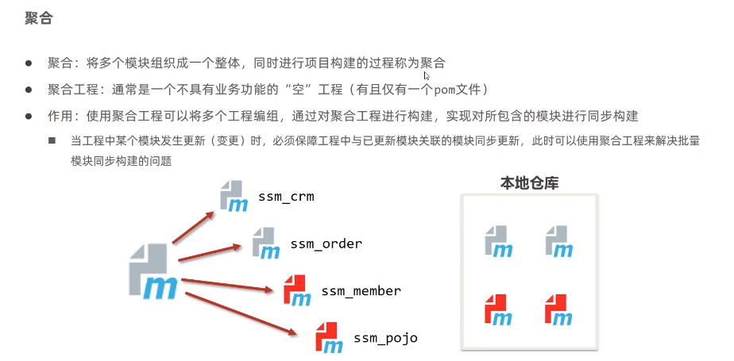
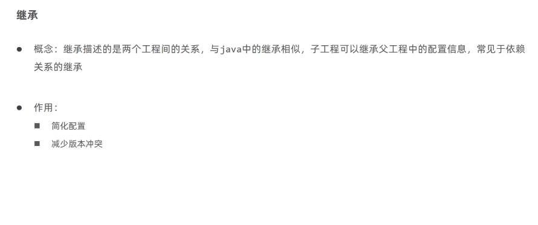
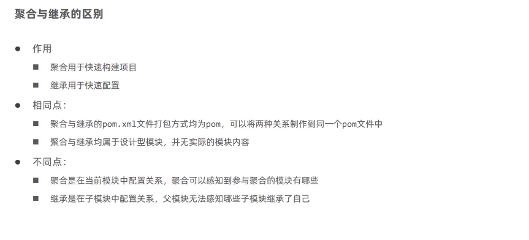
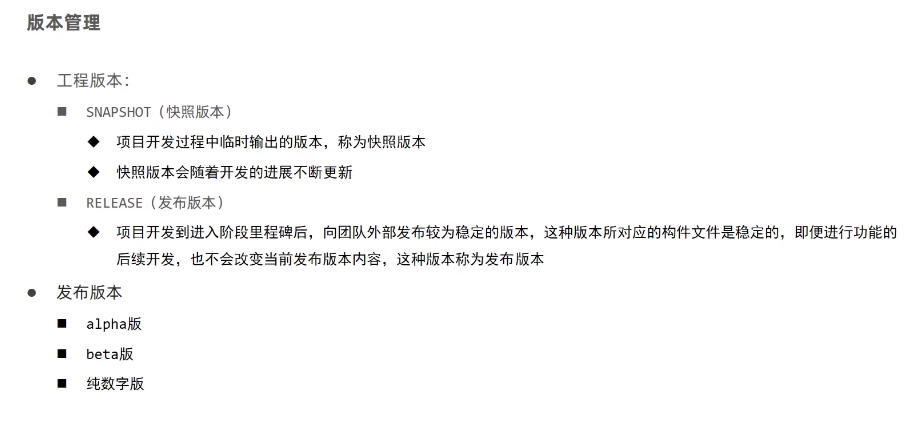
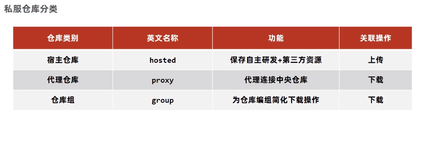
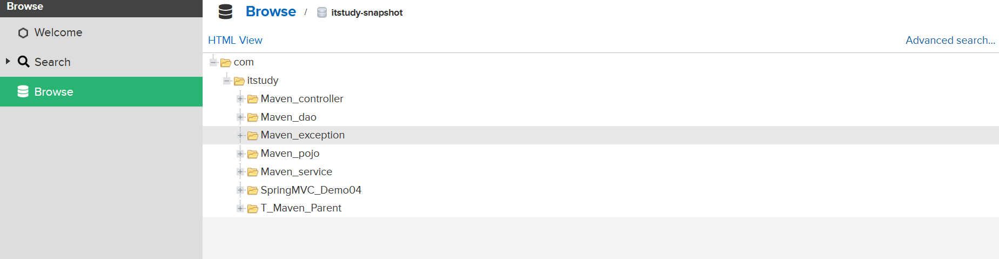

<!-- TOC -->

* [一. 分模块开发与设计](#一-分模块开发与设计)
* [二. 依赖管理](#二-依赖管理)
* [三. 聚合与继承](#三-聚合与继承)
* [四. 属性管理](#四-属性管理)
* [五. 多环境配置与应用](#五-多环境配置与应用)
* [六. 私服](#六-私服)

<!-- TOC -->

# 一. 分模块开发与设计

将原始模块按照功能拆分成若干个子模块, 方便模块间的相互调用, 接口共享

模块分离后需要将分离的模块安装到本地的maven仓库, 执行生命周期的install指令, 不然编译时在本地仓库是读不到这个模块的,
因为本地仓库没有

分模块开发书写模块代码, 分模块需要先针对模块功能进行设计, 再进行编码, 不会先将工程开发完毕, 然后进行拆分

# 二. 依赖管理

## 1. 依赖传递:

依赖具有传递性:

直接依赖:再当前项目中通过依赖配置建立的依赖关系
间接依赖:被资源的资源如果依赖其他资源,当前项目间接依赖其他资源

## 2. 依赖传递冲突问题:

路径优先: 当依赖中出现相同资源时,层级越深,优先级越低,反之越高
声明优先: 当资源在相同层级被依赖时,配置顺序靠前的覆盖配置顺序靠后的
特殊优先: 当同级配置了相同资源的不同版本, 后配置的覆盖先配置的

## 3. 可选依赖: 指对外隐藏当前所依赖的资源--不透明

加上option属性<optional>true</optional>

```xml

<dependency>
    <groupId>log4j</groupId>
    <artifactId>log4j</artifactId>
    <version>1.2.12</version>
    <optional>true</optional>
</dependency>
```

## 4. 排除依赖:指项目主动断开依赖的资源, 被排除的资源无需指定版本

属性标签为<exclusions></exclusions>

```xml

<dependency>
    <groupId>com.itstudy</groupId>
    <artifactId>java02</artifactId>
    <version>1.0-SNAPSHOT</version>
    <exclusions>
        <exclusion>
            <groupId>log4j</groupId>
            <artifactId>log4j</artifactId>
        </exclusion>
    </exclusions>
</dependency>
```

# 三. 聚合与继承

## 1. 聚合


创建个聚合工程的父模块, 这个模块的打包模式pom, 同时设置管理的模块

```xml
    <!--设置管理的模块名称-->
<modules>
    <module>../Maven_dao</module>
    <module>../Maven_pojo</module>
    <module>../Maven_exception</module>
    <module>../Maven_service</module>
    <module>../Maven_controller</module>
    <module>../SpringMVC_Demo04</module>
</modules>
```

## 2. 继承



父工程依赖的配置
```xml
 <!--设置管理的模块名称-->
<modules>
    <module>../Maven_dao</module>
    <module>../Maven_pojo</module>
    <module>../Maven_exception</module>
    <module>../Maven_service</module>
    <module>../Maven_controller</module>
    <module>../SpringMVC_Demo04</module>
</modules>

<dependencies>

<dependency>
    <groupId>org.springframework</groupId>
    <artifactId>spring-webmvc</artifactId>
    <version>5.2.10.RELEASE</version>
</dependency>

<dependency>
    <groupId>org.springframework</groupId>
    <artifactId>spring-test</artifactId>
    <version>5.2.10.RELEASE</version>
</dependency>

<dependency>
    <groupId>org.springframework</groupId>
    <artifactId>spring-jdbc</artifactId>
    <version>5.2.10.RELEASE</version>
</dependency>

</dependencies>

        <!--定义依赖管理-->
<dependencyManagement>
<dependencies>

    <dependency>
        <groupId>com.itstudy</groupId>
        <artifactId>Maven_service</artifactId>
        <version>1.0-SNAPSHOT</version>
    </dependency>

    <dependency>
        <groupId>com.itstudy</groupId>
        <artifactId>Maven_dao</artifactId>
        <version>1.0-SNAPSHOT</version>
    </dependency>

    <dependency>
        <groupId>com.itstudy</groupId>
        <artifactId>Maven_pojo</artifactId>
        <version>1.0-SNAPSHOT</version>
    </dependency>

    <dependency>
        <groupId>com.itstudy</groupId>
        <artifactId>Maven_exception</artifactId>
        <version>1.0-SNAPSHOT</version>
    </dependency>

    <dependency>
        <groupId>junit</groupId>
        <artifactId>junit</artifactId>
        <version>4.13.1</version>
        <scope>test</scope>
    </dependency>

    <dependency>
        <groupId>javax.servlet</groupId>
        <artifactId>javax.servlet-api</artifactId>
        <version>3.1.0</version>
        <scope>provided</scope>
    </dependency>

    <dependency>
        <groupId>org.mybatis</groupId>
        <artifactId>mybatis-spring</artifactId>
        <version>1.3.0</version>
    </dependency>

    <dependency>
        <groupId>org.mybatis</groupId>
        <artifactId>mybatis</artifactId>
        <version>3.5.6</version>
    </dependency>

    <dependency>
        <groupId>mysql</groupId>
        <artifactId>mysql-connector-java</artifactId>
        <version>8.0.28</version>
    </dependency>

    <dependency>
        <groupId>com.alibaba</groupId>
        <artifactId>druid</artifactId>
        <version>1.2.18</version>
    </dependency>

    <dependency>
        <groupId>org.aspectj</groupId>
        <artifactId>aspectjweaver</artifactId>
        <version>1.9.6</version>
    </dependency>

    <dependency>
        <groupId>com.fasterxml.jackson.core</groupId>
        <artifactId>jackson-databind</artifactId>
        <version>2.9.0</version>
    </dependency>

    <!--<dependency>
    <groupId>org.projectlombok</groupId>
    <artifactId>lombok</artifactId>
    <version>1.18.26</version>
</dependency>-->
</dependencies>
</dependencyManagement>
```
子工程依赖的配置
```xml
<!--配置当前工程继承自父工程-->
<parent>
    <groupId>com.itstudy</groupId>
    <artifactId>T_Maven_Parent</artifactId>
    <version>1.0-SNAPSHOT</version>
    <relativePath>../T_Maven_Parent/pom.xml</relativePath>
</parent>
<dependencies>
<dependency>
    <groupId>com.itstudy</groupId>
    <artifactId>Maven_controller</artifactId>
    <version>1.0-SNAPSHOT</version>
</dependency>

<dependency>
    <groupId>org.mybatis</groupId>
    <artifactId>mybatis-spring</artifactId>
</dependency>

<dependency>
    <groupId>com.alibaba</groupId>
    <artifactId>druid</artifactId>
</dependency>

<dependency>
    <groupId>junit</groupId>
    <artifactId>junit</artifactId>
    <scope>test</scope>
</dependency>
</dependencies>
```
## 3. 聚合与继承的区别

# 四. 属性管理
定义一个属性统一管理同一个名称的变量, 比如多个相同的版本
```xml

<properties>
    <!--定义属性-->
    <spring.version>5.2.10.RELEASE</spring.version>
</properties>
```

配置文件的加载属性
```xml

<build>
    <!--扫描加载配置文件的文件夹-->
    <resources>
        <resource>
            <directory>${project.basedir}/src/main/resources</directory>
            <filtering>true</filtering>
        </resource>
    </resources>
</build>

<properties>
<!--定义属性-->
<spring.version>5.2.10.RELEASE</spring.version>
<module.version>1.0-SNAPSHOT</module.version>

<!--jdbc配置文件-->
<jdbc.driver>com.mysql.cj.jdbc.Driver</jdbc.driver>
<jdbc.username>mybatis</jdbc.username>
<jdbc.password>mybatis</jdbc.password>
<jdbc.url>jdbc:mysql://localhost:3306/sql_store</jdbc.url>
</properties>
```
在jdbc.properties下

```properties
jdbc.driver=${jdbc.driver}
jdbc.username=${jdbc.username}
jdbc.password=${jdbc.password}
jdbc.url=${jdbc.url}
```

版本管理


# 五. 多环境配置与应用
## 1. 多环境开发
maven提供配置多种环境的设定, 帮助开发者使用过程中快速切换环境
```xml
    <!--配置多环境开发-->
<profiles>
    <!--开发环境-->
    <profile>
        <id>env_dep</id>
        <properties>
            <jdbc.url>jdbc:mysql://127.0.0.1:3306/sql_store</jdbc.url>
        </properties>
    </profile>
    <!--测试环境-->
    <profile>
        <id>env_test</id>
        <properties>
            <jdbc.url>jdbc:mysql://10.126.156.103:3306/sql_store</jdbc.url>
        </properties>
    </profile>
    <!--生产环境-->
    <profile>
        <id>env_pro</id>
        <properties>
            <jdbc.url>jdbc:mysql://127.0.0.1:3306/sql_store</jdbc.url>
        </properties>
    </profile>
</profiles>
```
设置启动命令 `mvn install -P env_dep`

## 2. 跳过测试加速打包
应用场景:
- 功能更新中并且没有开发完毕
- 快速打包
```xml

<plugins>
    <plugin>
        <groupId>org.apache.maven.plugins</groupId>
        <artifactId>maven-surefire-plugin</artifactId>
        <version>3.0.0</version>
        <configuration>
            <!--true跳过全部测试-->
            <skipTests>false</skipTests>
            <!--排除掉不参与测试的内容-->
            <excludes>
                <exclude>**/BookServiceTest.java</exclude>
            </excludes>
            <!--不排除参与测试的内容-->
            <includes>
                <exclude>**/BookDaoTest.java</exclude>
            </includes>
        </configuration>
    </plugin>
</plugins>
```
mvn 命令跳过测试:

mvn 指令 -D skipTests

如:

mvn install -D skipTests

# 六. 私服
## 1. 私服简介

## 2. 私服仓库分类
私服资源操作流程分析

## 3. 资源上传与下载
本地仓库资源上传私服仓库
- 上传的位置(宿主地址)
- 访问私服的用户名/密码
- 下载的地址(仓库组地址)
修改maven的配置文件

本地当前工程保存在私服的具体位置
```xml
<!--配置当前工程保存在私服的具体位置-->
<distributionManagement>
    <repository>
        <id>itstudy-release</id>
        <url>http://10.126.61.151:8081/repository/itstudy-release/</url>
    </repository>
    <snapshotRepository>
        <id>itstudy-snapshot</id>
        <url>http://10.126.61.151:8081/repository/itstudy-snapshot/</url>
    </snapshotRepository>
</distributionManagement>
```
运行生命周期deploy进行发布

